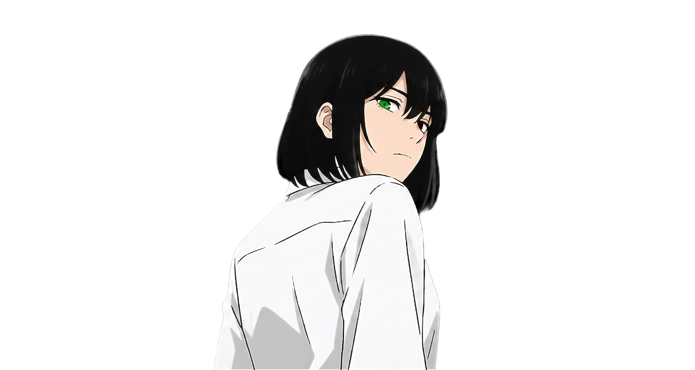
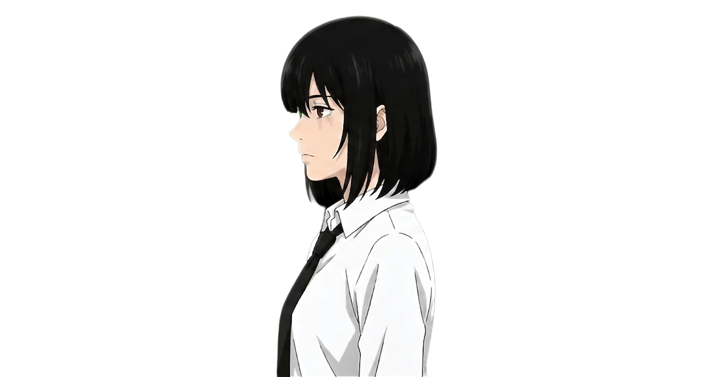

  

 

<!-- SOBRE MIM -->
<table width="100%">
  <tr>
    <td width="500px" align="center">
      
    </td>
    <td valign="top">
      <h2>whoami</h2>
      
I'm <strong>David</strong>, a developer based in Manaus, Amazonas, Brazil.

      
Currently studying at <a href="https://ciesa.br/"><strong>CIESA</strong></a> and working at <a href="https://www.eldorado.org.br/"><strong>Instituto de Pesquisa Eldorado</strong></a>.

       
      
I work with Python, C, HTML, CSS and JS, building projects, writing articles, creating motion content and leading technical teams.

      
Outside of code, I create content as <strong>nevext</strong>, videos about games and tech.

       
      
<a href="https://nevext.github.io/portfolio-html/">portfolio</a> &nbsp;|&nbsp; <a href="mailto:nevext@outlook.com">nevext@outlook.com</a>

    </td>
  </tr>
</table>
 

<!-- TECNOLOGIAS -->
<table width="100%">
  <tr>
    <td valign="top">
      <h2>tech stack</h2>
      
<strong>Code</strong>

      
      
<strong>Adobe Suite</strong>

      
      
<strong>Creative &amp; AI Tools</strong>

      
       
      
      
      
      
      
      
      
<strong>Knowledge Areas</strong>

      
      
      
      
      
      
      
    </td>
    <td width="500px" align="center">
      
    </td>
  </tr>
</table>
 

<!-- PROJETOS -->
<table width="100%">
  <tr>
    <td width="500px" align="center">
      
    </td>
    <td valign="top">
      <h2>projects</h2>
       
      
        
      
    </td>
  </tr>
</table>
 

<!-- STATS -->
<table width="100%">
  <tr>
    <td valign="top">
      <h2>stats</h2>
       
      
    </td>
    <td width="500px" align="center">
      
    </td>
  </tr>
</table>
 

<!-- CONTATO -->
<table width="100%">
  <tr>
    <td width="500px" align="center">
      
    </td>
    <td valign="top">
      <h2>contact</h2>
       
      
        
      
        
      
        
      
        
      
    </td>
  </tr>
</table>
 

  

