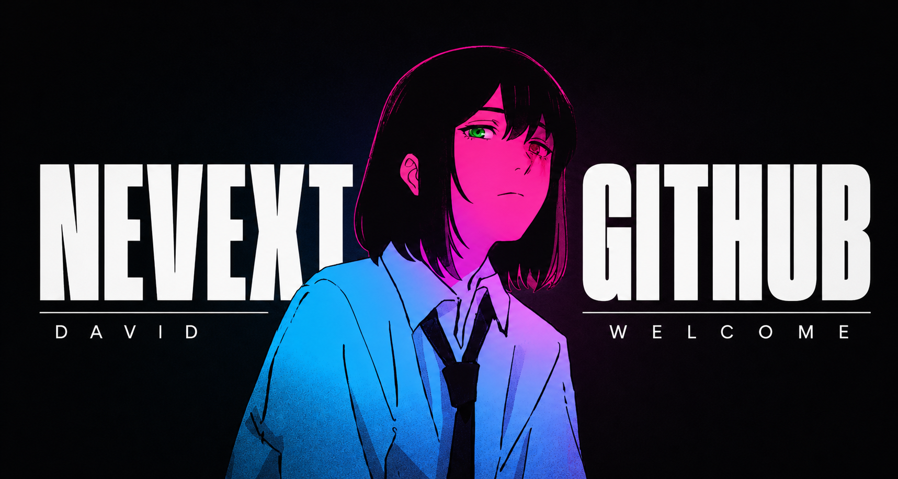

  

 

<!-- SOBRE MIM -->
<table>
  <tr>
    <td width="300px" align="center">
      
    </td>
    <td valign="top" padding="20px">
      <h2>whoami</h2>
      
Hey, I'm <strong>David</strong> — dev in progress, based in Brazil 🇧🇷

      <ul>
        <li>🎓 Studying at <strong>CIESA</strong></li>
        <li>💻 Building things with Python, JS and whatever gets the job done</li>
        <li>🎨 Creating <strong>Lolla</strong>, my original anime character</li>
        <li>🎮 Into anime, tech and creative projects</li>
      </ul>
    </td>
  </tr>
</table>

 

<!-- TECNOLOGIAS -->
<table>
  <tr>
    <td valign="top">
      <h2>tech stack</h2>
      
Languages & tools I work with:

       
      
    </td>
    <td width="300px" align="center">
      
    </td>
  </tr>
</table>

 

<!-- PROJETOS -->
<table>
  <tr>
    <td width="300px" align="center">
      
    </td>
    <td valign="top">
      <h2>projects</h2>
       
      
        
      
    </td>
  </tr>
</table>

 

<!-- STATS -->
<table>
  <tr>
    <td valign="top">
      <h2>stats</h2>
       
      
        
      
    </td>
    <td width="300px" align="center">
      
    </td>
  </tr>
</table>

 

<!-- CONTATO -->
<table>
  <tr>
    <td width="300px" align="center">
      
    </td>
    <td valign="top">
      <h2>contact</h2>
       
      
        
      
        
      
    </td>
  </tr>
</table>

 

  

